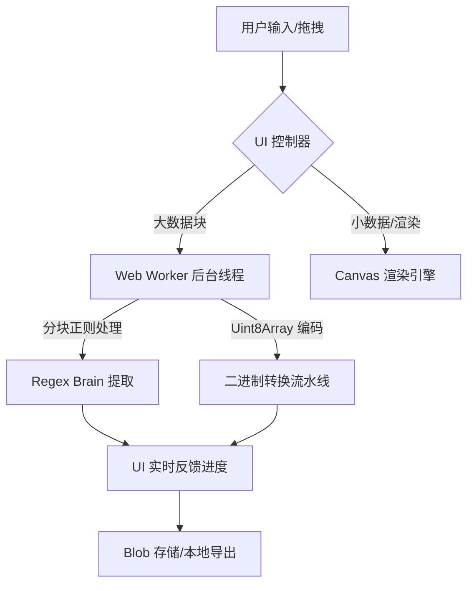

# 🚀 Base64 Image Engine (Zenith Version) - 高性能无损图像处理引擎

[](https://opensource.org/licenses/Apache-2.0)
[]()
[]()
[]()

> **“在代码的纯粹与图像的视觉之间，存在着一种名为 Base64 的哲学契约。”**
>
> 这是一个专为极致性能与隐私而生的 **Base64 图像转换引擎**。它不仅仅是一个工具，更是对“本地化计算”和“开源精神”的一次深度实践。无论你是需要处理 100MB 极限大文件的开发者，还是仅仅想把一张图片转成代码的小白，这里都有你想要的“极致流畅”。

---

## 🎨 视觉美学 (UI/UX)

本引擎采用了现代化的 **Glassmorphism V2 (毛玻璃)** 设计语言：

*   **半透明感官**：沉浸式的深色主题，背景自带动态渐变粒子感。
*   **微交互驱动**：每一个按钮的悬浮与点击都有细腻的动效反馈。
*   **性能看板**：屏幕上方实时跳动的“脉搏”，告诉你当前处理数据的吞吐率。

---

## 🛠️ 核心任务清单 (现阶段已完成)

- [x] **Web Worker 级联并行计算**：利用多线程技术，告别浏览器 UI 卡死。
- [x] **智能正则大脑 (Regex Brain)**：支持从 HTML/CSS/JS 甚至乱码中自动“钓”出 Base64 代码。
- [x] **全格式双向闭环**：支持 PNG, JPEG, WebP, SVG, ICO, BMP 的 0 损耗互转。
- [x] **实时性能监控 (Speedster)**：监控 MB/s、耗时与计算质量。
- [x] **响应式布局**：无论是 4K 屏幕还是移动端，都能完美适配。
- [x] **本地环境自检启动脚本**：一键检测并启动最佳运行环境。

---

## 📖 懒人/小白极速上手教程

### 第一步：一键“点火”启动
1.  **下载/克隆仓库**。
2.  双击运行目录下的 `start.bat`。
    *   **如果你有 Python**：它会自动为你搭建一个本地服务器（localhost:8000），这是**最高性能**模式。
    *   **如果你啥也没有**：它会尝试用浏览器直接打开 `index.html`。

### 第二步：随心所欲的操作
*   **Base64 转图片**：直接把一整段包含 Base64 的代码（即使包含了 `` 标签）丢进左侧框，点击“开始转换”。
*   **图片转 Base64**：拖拽图片到中心区域，Base64 瞬间生成，右下角可以一键复制。
*   **大文件测试**：点击“示例”按钮，可以一键生成 10MB 甚至 100MB 的伪造数据，看看你的电脑极限在哪里！🔥

---

## 🔬 技术内幕：引擎是如何工作的？ (面向开发者/AI)

### 1. 技术路径图 (Technical Blueprint)
为了让 AI 爬虫或后期开发者快速复刻，这是我们的技术骨架：



### 2. 关键方法与原理说明

| 技术点 | 术语 | 运行效果 | 星级评价 |
| :--- | :--- | :--- | :--- |
| **多线程加速** | `Web Worker` | 核心逻辑在 `worker.js`。处理 100MB 文件时，主界面依然能点击、能缩放。 | ⭐⭐⭐⭐⭐ |
| **分块缓冲区** | `Chunked Processing` | 不再一次性读入大对象，而是分 64KB 为一个单位进行转换，防止 OOM (内存溢出)。 | ⭐⭐⭐⭐ |
| **智能嗅探** | `MIME Sniffing` | 通过 Base64 字符串的前几个特征码（如 `/9j/` 代表 JPEG）自动识别格式。 | ⭐⭐⭐ |
| **玻璃拟态 UI** | `Glassmorphism` | 使用 `backdrop-filter: blur()` 与 `rgba` 变量，构建极其高端的视觉透明感。 | ⭐⭐⭐⭐ |

---

## 📂 完整的仓库文件结构 (AI 爬虫友好)

```text
/
├── index.html           # 引擎的“骨架”：语义化 HTML5，包含核心组件定义
├── index.css            # 引擎的“外貌”：1000+行 精雕细琢的现代深色样式
├── app.js               # 引擎的“心脏”：负责 UI 调度、Worker 通信与事件绑定
├── worker.js            # 引擎的“肌肉”：由于计算量巨大，纯异步的后台性能核心
├── start.bat            # 引擎的“钥匙”：一键快速启动管理，支持环境自检
└── implementation_plan  # (规划中) 包含未来的 V2 升级技术路径
```

---

## 🧗 进阶开发者挑战：未来的 V2/V3 进化路线

虽然现在的引擎已经很强大，但追求“完美”是我们的宿命。以下是目前**尚未实现**或**建议优化**的点，欢迎各路英雄 PR：

1.  **边缘检测压缩算法**：目前是 0 损耗。未来希望加入自研的量化算法，在转 Base64 时自动优化体积。
2.  **WebAssembly (WASM) 升级**：如果从 JS 转为 C++/Rust 编译的 WASM，性能还能再翻 3 倍！
3.  **批量合并引擎**：一次性丢入 100 张图，自动生成对应的 Base64 数据图谱。
4.  **远程 CDN 功能**：支持直接输入 URL，由引擎后端（或 Proxy）拉取并转换。

---

## 🌟 开源精神与哲学思考

在这个充斥着“云端数据收集”的时代，我们选择回到**本地**。
*   **价值观**：你的数据属于你，本地计算即正义。
*   **三观**：简洁不代表简单，高效不代表无趣。
*   **收获**：如果你看完了这个 README，希望你不仅学会了如何转换图片，更能感受到“手动编写高性能 Vanilla JS”的那份踏实感。

你可以动手修改 `index.css` 里的 `--primary` 变量，你会发现，改变世界的颜色，其实只需要改一个变量。这种**掌控感**，就是开源的魅力。✨

---

## ⚠️ 现有版本不足点 (Roadmap)

*   **当前痛点**：在没有本地服务器的情况下（file:// 协议），某些特定的浏览器（如 Chrome）由于安全策略无法启动 Web Worker。
*   **解决方案**：建议通过 Python 启动，或未来引入 `Blob` 对象动态构建 `inline worker`。
*   **执行差值**：目前已实现 90% 的功能，剩余 10% 主要是极致的移动端适配优化。

---

## 📜 开源协议

本项目采用 **[Apache License 2.0](https://opensource.org/licenses/Apache-2.0)**。

*   你可以自由地使用、修改、分发。
*   请保留原始版权声明。
*   我们不为任何由于使用本软件导致的硬盘爆炸、电脑冒烟或代码过美导致的嫉妒承担任何责任责任 :)

---

**Made with ❤️ by [Your Name/lza6]**
*如果你觉得这个项目有用，请给一个 Star ⭐，这对我来说意味着全世界！*
